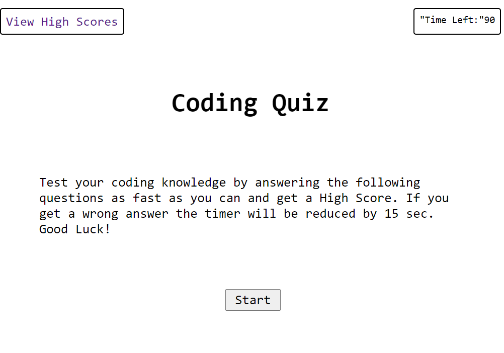

# Code-Quiz

## Description

Code quiz is a monochromatic Web page that will test your Coding Knowledge with a timed quiz that will deduct time from the timer if you get an answer wrong.
Try to get a High score and see if you are among the best players by saving your score inputting your initials at the end of the game.
Once you run out of time is Game Over!

## Installation

N/A

## Usage

Click start and answer the questions by following the prompts. Enter your initials at the end to record your score among the other High Scores.
Remember to not get any wrong answers or your time will decrease by 15 sec.

## Credits

N/A

## License

N/A

## link

The following image shows the web application's appearance:

## Screenshot

The following link displays the application on the web.

